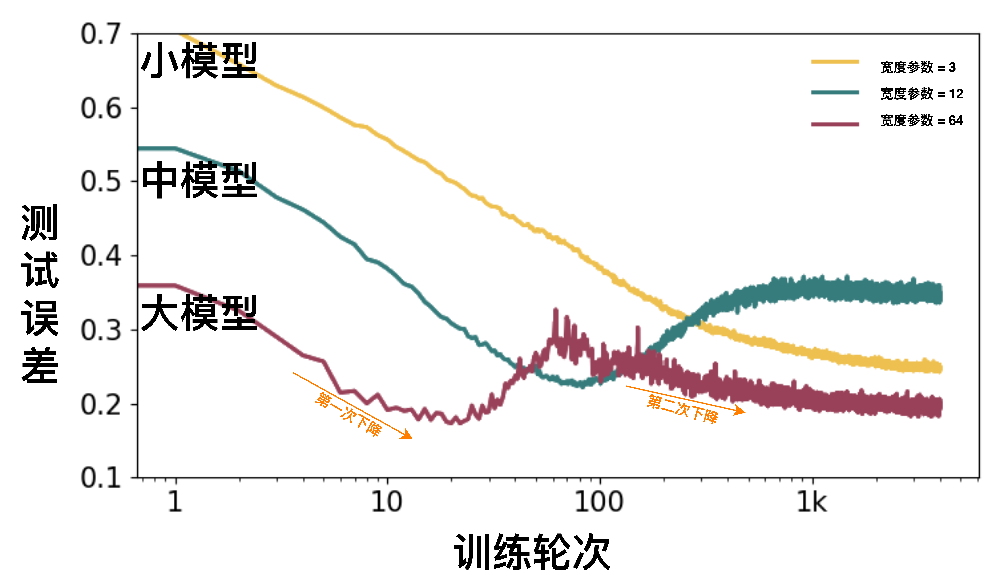

# 第2章：可学性

*编辑：赵志民，王茂霖，李一飞，Hao ZHAN*

---

## 本章前言

本章的内容围绕学习理论中的可学性理论展开，主要讨论「事件是否能够通过机器学习来解决」这一问题。通过学习理论事先辨别某个问题是否能够被学习，将节省大量的时间与资源。

在讨论学习算法的设计之前，首先要思考以下几个问题：这个问题是否能被解决（从模型的角度看是否可学习），哪些内容容易学习（如两个凸集），哪些内容难学习（如两个非凸集之间的划分），在可学习的情况下，所需的样本量以及通用的学习模型有哪些？

在本章中，我们将通过介绍 "概率近似正确的"（PAC）学习框架，开始正式讨论这些问题。PAC 框架有助于根据实现近似解所需的样本点数量、样本复杂度以及学习算法的时间/空间复杂度（取决于概念的计算表示成本）来定义可学习的概念。

我们首先会描述 PAC 框架并对其进行说明，然后针对所用假设集包含要学习的概念的一致情况和相反的不一致情况，介绍当所用假设集有限时该框架内的一些一般学习保证。

### 2.1 【概念补充】概念与假设空间

在具体介绍 PAC 模型之前，首先需要明确几个基础定义和符号，这些定义和符号将贯穿本书的大部分内容：

> **输入空间** $X$：表示所有可能的例子或实例的集合。$X$ 有时也被称为输入空间。  
> **输出空间** $Y$：表示所有可能的标签或目标值的集合。$Y$ 有时也被称为输出空间。

在本介绍性章节中，我们将 $Y$ 限制为只有两个标签的情况，即 $Y = \{0, 1\}$（或者 $Y = \{-1, 1\}$，两者仅是符号上的替代）。例如，$Y$ 也可以是 $\{皮卡丘, 海绵宝宝\}$。这是二元分类问题的典型假设。虽然这种简化假设便于理解，但并不会影响后续推论的路径与思路，因为多分类问题只是二分类问题的扩展，虽然从证明和论证上更为复杂。后续章节将扩展这些结果以涵盖更一般的情况。

从数学角度看待机器学习中的概念，机器学习可以定义为学习一个映射函数：

> **概念**(concept) $c : X \rightarrow Y$ 是一个从 $X$ 到 $Y$ 的映射。由于 $Y = \{0, 1\}$，我们可以将 $c$ 视为从 $X$ 中得到其取值为 $1$ 的部分，即 $X$ 的子集。

在学习理论中，学习的概念可以等同于从 $X$ 到 $\{0, 1\}$ 的映射，或 $X$ 的子集。概念类是我们希望学习的概念的集合，用 $\mathcal{C}$ 表示。例如，它可以是平面中所有三角形的集合。

> **假设空间**（hypothesis space）$\mathcal{H}$ 是指所有可能假设的集合，每个假设 $h \in \mathcal{H}$ 是一个从输入空间 $X$ 到输出空间 $Y$ 的映射函数，形式化定义为：  
$$
\begin{equation}
\mathcal{H} = \{h: X \rightarrow Y\}
\end{equation}
$$

假设空间的大小和复杂性决定了算法能够学习到的解决方案的类型。如果假设空间太小或太简单，它可能无法捕捉到数据中的复杂模式，导致欠拟合（Underfitting）。相反，如果假设空间过大或太复杂，它可能包含过于复杂的模型，这些模型可能会过度拟合（Overfitting）训练数据，从而在新的、未见过的数据上表现不佳。

例如，在一个简单的线性分类器中，假设空间可能包括所有可能的线性边界，每个线性边界都是一个假设。在更复杂的模型中，如神经网络，假设空间可能包括所有可能的网络结构和权重配置，这些构成了网络的能力来学习数据的非线性和复杂模式。

虽然这种理解适用于机器学习，但我们必须注意，对于深度学习，需要进一步的考虑。例如双下降现象与传统机器学习理论相矛盾，后者认为增加模型大小和数据量通常会提高模型的泛化性能。

双下降现象中描绘模型泛化性能的曲线图由三个阶段组成：
1. 第一阶段：当模型规模小且数据量不足时，模型泛化性能较差。
2. 第二阶段：随着模型规模和数据量的增加，模型泛化性能最初出现下降。
2. 第三阶段：随着模型规模和数据量的进一步增加，模型泛化性能再次下降，但最终达到更好的水平。
双下降现象的出现表明，对于深度神经网络来说，增加模型规模和数据量并不总是有益的。因此，应该采用诸如正则化和增广策略等技术，有效地控制模型规模和数据量，以实现最佳的泛化性能。更多实验细节参考文献：[Deep Double Descent: Where Bigger Models and More Data Hurt](https://arxiv.org/abs/1912.02292)）。

### 2.2 【概念补充】经验误差与泛化误差

为了衡量学习到的概念 $h$ 与目标概念 $c$ 之间的差异，定义了以下的度量方式：

**泛化误差**：  
$$
\begin{equation}
R(h)=\underset{x\sim\mathcal{D}}{\operatorname*{\mathbb{P}}}\left[h(x)\neq c(x)\right]=\underset{x\sim\mathcal{D}}{\operatorname*{\mathbb{E}}}\left[1_{h(x)\neq c(x)}\right], \tag{1}
\end{equation}
$$
其中，$1_{\omega}$ 是事件 $\omega$ 的指示函数。

由于泛化误差无法直接求得（其原因在于 $\mathcal{D}$ 的未知性），我们需要利用能够获取的信息来近似泛化误差，因此定义了经验误差：

**经验误差**：  
$$
\begin{equation}
\widehat{R}_S(h)=\frac{1}{m}\sum_{i=1}^{m}1_{h(x_i)\neq c(x_i)}.\tag{2}
\end{equation}
$$

经验误差的期望等于其泛化误差：

$$
\begin{equation}
\mathrm{E}[\widehat{R}(h ; D)]=R(h ; \mathcal{D})
\end{equation}
$$

证明过程分为两步，首先考察等式右边，泛化误差可表示为： 

$$
\begin{equation}
R(h ; \mathcal{D})=P_{(x, y) \sim \mathcal{D}}(h(x) \neq y)=\mathbb{E}_{(x, y) \sim \mathcal{D}}[\mathbb{I}(h(x) \neq y)]
\end{equation}
$$

然后考察等式左边，经验误差可表示为： 

$$
\begin{equation}
\widehat{R}(h ; D)=\frac{1}{m} \sum_{i=1}^{m} \mathbb{I}\left(h\left(\boldsymbol{x}_{i}\right) \neq y_{i}\right)
\end{equation}
$$

经验误差的期望为： 

$$
\begin{equation}
\mathrm{E}[\widehat{R}(h ; D)]=\underset{D \sim D^{m}}{\mathrm{E}}[\widehat{R}(h)]=\frac{1}{m} \sum_{i=1}^{m} \underset{(x,y) \sim D}{\mathrm{E}}[\mathbb{I}\left(h\left(\boldsymbol{x}_{i}\right) \neq y_{i}\right)]
\end{equation}
$$
 
由于样本服从独立同分布，所有样本的期望值相同，期望的平均值就等于样本的期望，因此：

$$
\begin{equation}
\mathrm{E}[\widehat{R}(h ; D)]=R(h ; \mathcal{D})
\end{equation}
$$

证毕。

### 2.3【概念补充】假设空间的可分性与学习的复杂度

假设空间的可分性决定了学习算法能否有效地找到正确的假设。我们讨论假设空间的可分性与不可分性，并探讨可分性对于学习算法性能的影响。

- **假设空间**：可分性是一个针对假设空间的概念，即考察对于给定学习算法，是否存在能够完全区分所有样本的映射。如果存在，则该学习算法对于此假设空间可分；如果不存在，则不可分。

可分性的严格性指的是其要求所有样本都可分。有时，由于噪声或异常值的影响，数据并非完全可区分，算法只能区分绝大多数样本。因此，可分性并未完全定义学习算法的有效性。

此外，可分性仅表示了学习算法的能力上限。例如，当我们在线性模型中使用高斯核技巧时，能够对任意二分类样本进行区分（维度为无穷）。但从如此庞大的假设空间中找到正确映射函数却非常困难，这在深度学习中尤为明显。在这个意义上，可分性仅表示了学习算法的能力上限。

#### 时间复杂度与样本复杂度

时间复杂度和样本复杂度是评估学习算法效率的两个重要指标。我们讨论这两个概念的等价性，以及它们对学习算法选择的影响。

由于不同的机器、操作系统会带来完全不同的运行时间，因此在考察时间复杂度时通常会使用抽象机。抽象机通常是抽象意义上的图灵机或实体意义上的图灵机。在该抽象机中，时间复杂度被定义为「需要执行的“操作”数量」。

一般而言，学习问题是否可以有效解决，取决于如何将其分解为一系列特定的学习问题。考虑学习有限假设类的问题，例如训练样本的数量为 $m_H(\epsilon，δ)= \log(|\mathcal{H}|/δ)/\epsilon^2$ 的情况。如果对一个 $h$ 的评估花费固定的时间，那么可以通过对 $\mathcal{H}$ 进行详尽搜索，在时间 $O(|H|m_H(\epsilon，δ))$ 内完成这项任务。对于任何固定的有限假设类 $\mathcal{H}$，穷举搜索算法都可以在多项式时间内运行。如果问题序列 $|H_n| = n$，那么穷举搜索被认为是高效的；如果 $|H_n| = 2^n$，则样本复杂度为 $n$ 的多项式，而穷举搜索算法的计算复杂度随 $n$ 呈指数增长。此时，穷举搜索被认为是低效的。

### 2.4 【概念补充】PAC-Bayes理论与样本复杂度

PAC学习理论主要研究如何在有限的样本和计算资源下，从给定的假设空间中找到一个近似正确的假设。PAC-Bayes理论结合了PAC学习和贝叶斯方法的优点，其核心思想是通过考虑假设空间中的概率分布来描述学习算法的行为，并给出关于学习算法在有限数据情况下泛化误差的界限。

PAC-Bayes不等式是PAC-Bayes理论的核心结果之一，它为后验分布下的泛化误差提供了一个上界。典型的PAC-Bayes不等式形式如下（详细证明参考：[PAC-Bayesian Stochastic Model Selection](https://link.springer.com/article/10.1023/A:1021840411064)）：
$$
\begin{equation}
\mathbb{E}_{Q}[L(h)] \leq \mathbb{E}_{Q}[\hat{L}(h)] + \sqrt{\frac{KL(Q \| P) + \ln\frac{1}{\delta} + \ln m + \ln 2}{2m-1}}
\end{equation}
$$

其中：
- $L(h)$ 是假设 $h$ 的真实误差（泛化误差）。
- $\hat{L}(h)$ 是假设 $h$ 在训练集上的经验误差。
- $Q$ 是假设的后验分布。
- $P$ 是假设的先验分布。
- $KL(Q \| P)$ 是后验分布 $Q$ 和先验分布 $P$ 之间的 KL 散度。
- $\delta$ 是置信参数，表示上界成立的概率。
- $m$ 是样本数量。

### 2.5【概念补充】布尔函数与不可知学习的难度

在布尔函数中，关于 $d$ 个输入变量有 $2^d$ 种可能。假设我们有 $x_1 = 0 , x_2 = 1$ ，输出为 0；这就删除了  $h5、h6、h7、h8、h13、h14、h15、h16$。这就是学习的一种方式。

例如，如果你有 $𝑛$ 个布尔变量 $x_1, x_2, … , x_n$，那么一个数据 $x$ 可以是这些变量的一个具体取值，例如 $(1,0,1,…,0)$。

布尔函数学习案例展示了不可知学习中的难度。不可知学习意味着我们不知道目标函数的确切形式，但我们希望通过给定的样本集去逼近最优的假设。这种情况下，可能存在多个假设与给定样本一致，因此如何在多个假设中选择最佳的假设是不可知学习的一个挑战。

### 2.6【定理证明】3项析取范式的不可PAC学习性

我们想要证明3项析取范式(3-term Disjunctive Normal Form, DNF)的类在概率近似正确学习(PAC learning)下是难以学习的，除非 $RP = NP$。

#### 3项DNF的定义

- **3项DNF公式**: 由三个子句（项）组成，每个子句是布尔变量的合取（AND）。整个公式是这三个子句的析取（OR）。
- **公式的大小**: 由所有子句中的文字（变量或其否定）数量之和决定。对于$n$个布尔变量，这个大小最多为$6n$。

#### $RP \neq NP$

在计算复杂性理论中，$RP$ 类包含那些可以通过随机算法在多项式时间内解决的问题，其中算法在给定一个“是”的实例时有很高的概率（至少 $1/2$）返回“是”，而在给定一个“否”的实例时总是返回“否”。$NP$ 类包含那些在多项式时间内可以被验证而不一定是被解决的问题。$RP \neq NP$ 这个表达的意思是假设 $RP$ 类和 $NP$ 类是不相同的。即，存在一些问题在 $NP$ 中，但不在 $RP$ 中。

#### 证明策略

我们通过将一个NP完全问题（在这里选择图的3-着色问题）化简为学习3项DNF公式的问题来进行证明。关键是构造一个样本集$S_G$，使得如果图$G$是3-可着色的，那么存在一个3项DNF公式与$S_G$一致；反之，如果$G$不可3-着色，那么不存在这样的公式与$S_G$一致。

#### 图的3-着色问题

- **图的3-着色**: 给定一个无向图$G=(V,E)$，判断是否可以用三种颜色对顶点进行着色，使得任意一条边的两个端点颜色不同。

#### 构造样本集 $S_G$

- **正例 $S_G^+$**: 对于每个顶点$i$，构造向量$v(i)$，该向量在第$i$位为0，其他位为1，并标记为正例$(v(i), 1)$。
- **反例 $S_G^-$**: 对于每条边$(i, j)$，构造向量$e(i,j)$，该向量在第$i$和第$j$位为0，其他位为1，并标记为反例$(e(i,j), 0)$。

#### 一致性和3-可着色性的等价性

- **一致性**: 如果一个3项DNF公式对样本集$S_G$中的所有样本都给出正确的分类结果，我们说这个公式与$S_G$一致。
- **等价性**: 图$G$是3-可着色的，当且仅当存在一个3项DNF公式与$S_G$一致。

#### 3项DNF公式的构造

详细说明如何根据图$G$的3-可着色性构造3项DNF公式，并解释为什么这种构造与样本集$S_G$一致。

- **颜色划分与子句构造**：
  - 假设图$G$是3-可着色的，意味着我们可以将所有顶点分成三组，分别着红、蓝、黄三种颜色。
  - 对于每种颜色，我们构造一个合取项。例如，假设$T_R$表示红色顶点的集合，那么$T_R$由所有不着红色的顶点的变量的否定组成。
  - 例如，如果顶点$j$和$k$不着红色，则$T_R = \neg x_j \wedge \neg x_k$。这里的$\neg x_j$表示顶点$j$没有被着红色。

- **正例与一致性**：
  - 对于每个正例$v(i)$，我们需要这个向量能满足某个子句$T_c$，即$v(i)$输入到$T_c$中时，$T_c$应该为真。
  - 假设顶点$i$被着成红色，那么$v(i)$中在第$i$位是0，其他位置是1。此时，$v(i)$会使$T_R$为真，因为$T_R$的合取项中的所有文字都与$v(i)$一致——即$v(i)$中对应于非红色顶点的位置都是1，这些位置的$\neg x_j$为真。

- **反例与一致性**：
  - 对于每条边$(i, j)$的反例$e(i,j)$，我们需要这个向量不能满足整个DNF公式$T_R \vee T_B \vee T_Y$，即$e(i,j)$输入到该公式中时，公式应为假。
  - 假设顶点$i$着红色，顶点$j$着蓝色。则$T_R$由不着红色的顶点变量的否定组成，$T_B$则由不着蓝色的顶点变量的否定组成。
  - 因为$e(i,j)$在第$i$和$j$位都是0，$T_R$的合取项需要这些位是1才能为真，因此$e(i,j)$不能满足$T_R$。同理，由于$j$着蓝色，$e(i,j)$也不能满足$T_B$，同样它也不能满足$T_Y$。

因此，对于每个反例$e(i,j)$，公式$T_R \vee T_B \vee T_Y$都不会为真，这就保证了公式与样本集$S_G$一致。

如果我们可以有效地学习3项DNF公式，那么就可以用它来解决 $NP$ 完全问题（如图的3-着色），这意味着$RP = NP$。由于普遍认为$RP \neq NP$，所以3项DNF类在PAC学习下是不可有效学习的。
