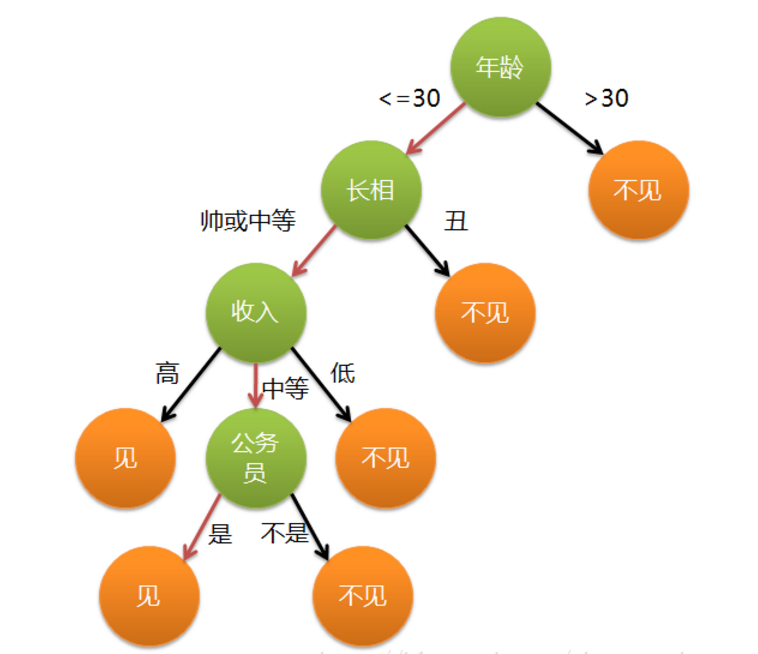

# 第6章：一致性

*Edit: 王茂霖，Hao ZHAN，赵志民*

---

本章的内容围绕学习理论中的一致性（consistency）展开。一致性关注的是随着训练数据的增加，通过学习算法所学习到的分类器是否趋于贝叶斯最优分类器。具体内容包括一致性的定义、参数方法下的一致性分析和非参方法下的一致性分析，以及随机森林的一致性分析案例。

### 1. 【公式证明】泛化风险的无偏估计

**P117**中，公式（6.25）中给出了分类器的经验风险$\hat R$，并提到了其为泛化风险$R$的无偏估计。这里对于这一概念进行说明。
首先，我们需要理解经验风险$\hat R$和泛化风险$R$这两个概念。经验风险是根据模型的预测结果和真实结果的比较从而计算出的风险指标，是可以量化的。泛化风险是在模型给定的情况下，基于数据-标签联合分布的样本（视为随机变量）的预测结果和真实值的比较的期望值，而这一指标在数据-标签联合分布未知的情况下是不可能求得的（在实际情况下，数据的分布往往是未知的），且如果在数据标签联合分布已知的情况下，我们其实也不需要去学习模型了（数据分布本身就是最好的生成模型）。所以泛化风险$R$这一概念可以说是一个理论化的概念。
其次，我们这里对于无偏估计进行说明，当我们说$y$是$x$的无偏估计的时候，就代表$\mathbb{E}{x}=y$。

泛化风险定义：
$$
\begin{aligned}
R(f) &=\mathbb{E}_{(\boldsymbol{x}, y) \sim \mathcal{D}}[\mathbb{I}(y f(\boldsymbol{x}) \leqslant 0)] \\
&=\mathbb{E}_{\boldsymbol{x} \sim \mathcal{D}_{\mathcal{X}}[\eta(\boldsymbol{x}) \mathbb{I}(f(\boldsymbol{x}) \leqslant 0)+(1-\eta(\boldsymbol{x})) \mathbb{I}(f(\boldsymbol{x}) \geqslant 0)]}
\end{aligned}
$$

经验风险定义：
$$
\hat R(f)  = \frac{1}{m} \sum_{i=1}^{m} \mathbb{I}\left(y_{i} f\left(\boldsymbol{x}_{i}\right) \leqslant 0\right)
$$

现在我们来证明经验风险是泛化风险的无偏估计：
首先这需要一些先验假设，我们假设所有的样本都是从一个未知的样本-标签空间$D$中独立同分布采样的。由此，对于经验风险求期望：
$$
\begin{aligned}
\mathbb{E}({\hat R(f)}) &=\mathbb{E}_{(\boldsymbol{x_i}, y_i) \sim \mathcal{D}}[{ \frac{1}{m} \sum_{i=1}^{m} \mathbb{I}\left(y_{i} f\left(\boldsymbol{x}_{i}\right) \leqslant 0\right)}] \\
&= \frac{1}{m} \sum_{i=1}^{m} \mathbb{E}_{(\boldsymbol{x_i}, y_i) \sim \mathcal{D}}[{ \mathbb{I}\left(y_{i} f\left(\boldsymbol{x}_{i}\right) \leqslant 0\right)}]\\
&= \frac{1}{m} \sum_{i=1}^{m} \mathbb{E}_{(\boldsymbol{x}, y) \sim \mathcal{D}}[{ \mathbb{I}\left(y f\left(\boldsymbol{x}\right) \leqslant 0\right)}]\\
&= \frac{1}{m} \sum_{i=1}^{m} R(f)\\
&= R(f)
\end{aligned} 
$$

### 2. 【定理补充】替代函数一致性

**P120**的定理6.1给出了替代一致性的充分条件。我们首先给出了函数的泛化风险和贝叶斯风险差值的不等式，根据一致性的定义，我们需要证明，${R_{\phi}\left(\hat{f}_{m}\right) \rightarrow R_{\phi}^{*}}$时$R\left(\hat{f}_{m}\right) \rightarrow R^{*}$。所以我们需要进一步构造关于${R_{\phi}\left(\hat{f}_{m}\right) - R_{\phi}^{*}}$的不等式。
然后利用两个不等式的关联性，最终得到$R\left(\hat{f}_{m}\right)-R^{*} \leqslant 2 c \sqrt[s]{R_{\phi}\left(\hat{f}_{m}\right)-R_{\phi}^{*}}$，从而证明${R_{\phi}\left(\hat{f}_{m}\right) \rightarrow R_{\phi}^{*}}$时$R\left(\hat{f}_{m}\right) \rightarrow R^{*}$。其中关于 不等式（6.40），其中包含着一定的构造技巧，然后再利用定理中的条件从而得到了 不等式（6.43）。再利用构造的凸函数性质，从而证明了最终的结论。

### 3. 【概念补充】划分机制方法

P122，介绍一种将样本空间划分成多个互不相容的区域，然后对各区域中对正例和反例分别计数，以多数的类别作为区域中样本的标记的方法。这种方法在本质上与参数方法不同，它并非是在参数空间中进行搜索，从而对样本空间上构建一个划分超平面的方法，而是直接在泛函空间上进行搜索。

一种典型的方案就是我们熟悉的决策树模型：

每当构造一个决策树的节点时，相当于在样本空间上进行了一次划分（即划分机制）。
这个洞察方式同样适用于解释剪枝操作，即通过减少不必要的节点来简化树结构，同时保持或提高模型的性能。

### 4. 【概念解释】依概率成立

**P124**的定理6.2中提到了一个定义，叫做依概率成立，这是概率论与数理统计中的知识点，可用如下的公式表达：$\lim _{n \rightarrow \infty} P((Diam(\Omega)-0) \geq \epsilon)=0$和对于所有$N>0$,$\lim _{n \rightarrow \infty} P((N(x)>N)=1$。其代表着当$n$趋于无穷的时候，几乎处处的$Diam(\Omega)$都在$0$的$\epsilon$邻域。$N(x)$的极限几乎处处都为无穷。依照概率成立是比极限更弱的一种情况（可以忽略概率趋于$0$处的情况）。

### 5. 【定理补充】划分机制一致性

**P124**定理6.2给出了划分一致性的充分条件，首先我们定义了$\Omega(\boldsymbol{x})$这样一个划分区域的条件概率的极大似然估计量：
$$
\hat{\eta}(\boldsymbol{x})=\sum_{\boldsymbol{x}_{i} \in \Omega(\boldsymbol{x})} \frac{\mathbb{I}\left(y_{i}=+1\right)}{N(\boldsymbol{x})}
$$
再由估计量根据划分机制构造出了分类器（输出函数）$h_{m}(\boldsymbol{x})=2 \mathbb{I}\left(\hat{\eta}(\boldsymbol{x}) \geqslant \frac{1}{2}\right)-1$。根据划分机制的一致性，我们此处就需要证明，其输出函数的泛化风险在$m$趋于无穷时，趋于贝叶斯风险。而此处利用的为基于条件概率估计的插值法，所以基于引理 6.2我们会得到其输出函数的泛化风险和贝叶斯风险差值的不等式，在对于不等式右侧的期望利用三角不等式进行放缩可得到（6.62）。

根据假设的条件：
$$\lim _{m \rightarrow \infty} P((Diam(\Omega)-0) \geq \epsilon) =  \lim _{m \rightarrow \infty} P(( \sup _{\boldsymbol{x}, \boldsymbol{x}^{\prime} \in \Omega}\left\|\boldsymbol{x}-\boldsymbol{x}^{\prime}\right\| -0) \geq \epsilon)=0$$

由于$\eta(x)$具有在样本空间中具有连续性，因此在任意邻域中我们都可以用$\hat\eta(x)$的期望值来近似$\eta(x)$。当邻域趋于0时，我们可以得到：
$$
\mathbb{E}[|\bar{\eta}(\boldsymbol{x})-\eta(\boldsymbol{x})|] \rightarrow 0
$$
这是由于${x}^{\prime}$被依概率限制到了一个$\epsilon$邻域内，而期望可以不考虑概率趋于0的点，由此$\bar{\eta}(\boldsymbol{x})$由于其$\eta(x)$的连续性也被限制到了一个$\eta(x)$的$\epsilon$邻域内。从而期望的极限得证。
接下来，再对于三角不等式右式的前半部分，将其拆分为了$N(x)=0$和$N(x)>0$两部分：
$$
\begin{array}{c}
\mathbb{E}\left[|\hat{\eta}(\boldsymbol{x})-\bar{\eta}(\boldsymbol{x})| \mid \boldsymbol{x}, \boldsymbol{x}_{1}, \ldots, \boldsymbol{x}_{m}\right] = 
\mathbb{E}\left[|\hat{\eta}(\boldsymbol{x})-\bar{\eta}(\boldsymbol{x})|\mid N(x)=0 , \boldsymbol{x}, \boldsymbol{x}_{1}, \ldots, \boldsymbol{x}_{m}\right] \\
+\mathbb{E}\left[\left|\sum_{\boldsymbol{x}_{i} \in \Omega(\boldsymbol{x})} \frac{\mathbb{I}\left(y_{i}=+1\right)-\bar{\eta}(\boldsymbol{x})}{N(\boldsymbol{x})}\right| N(\boldsymbol{x})>0, \boldsymbol{x}, \boldsymbol{x}_{1}, \ldots, \boldsymbol{x}_{m}\right]\\
\leqslant P\left(N(\boldsymbol{x})=0 \mid \boldsymbol{x}, \boldsymbol{x}_{1}, \ldots, \boldsymbol{x}_{m}\right) + \mathbb{E}\left[\left|\sum_{\boldsymbol{x}_{i} \in \Omega(\boldsymbol{x})} \frac{\mathbb{I}\left(y_{i}=+1\right)-\bar{\eta}(\boldsymbol{x})}{N(\boldsymbol{x})}\right| N(\boldsymbol{x})>0, \boldsymbol{x}, \boldsymbol{x}_{1}, \ldots, \boldsymbol{x}_{m}\right]
\end{array}
$$
然后对于不等式右侧的第二部分，再利用引理6.3的不等式我们可以得到：
$$
\begin{array}{l}
\mathbb{E}\left[\left|\sum_{\boldsymbol{x}_{i} \in \Omega(\boldsymbol{x})} \frac{\mathbb{I}\left(y_{i}=+1\right)-\bar{\eta}(\boldsymbol{x})}{N(\boldsymbol{x})}\right| N(\boldsymbol{x})>0, \boldsymbol{x}, \boldsymbol{x}_{1}, \ldots, \boldsymbol{x}_{m}\right] \\
\leqslant \mathbb{E}\left[\sqrt{\frac{\bar{\eta}(\boldsymbol{x})(1-\bar{\eta}(\boldsymbol{x}))}{N(\boldsymbol{x})}} \mathbb{I}(N(\boldsymbol{x})>0) \mid \boldsymbol{x}, \boldsymbol{x}_{1}, \ldots, \boldsymbol{x}_{m}\right]
\end{array}
$$
对于此不等式的右侧，再进行放缩，对于任意$k \geq 3$，当$N(x) \leqslant k$时，$\sqrt{\frac{\bar{\eta}(\boldsymbol{x})(1-\bar{\eta}(\boldsymbol{x}))}{N(\boldsymbol{x})}} \leqslant \frac12$, 当$N(x) > k$时,$\sqrt{\frac{\bar{\eta}(\boldsymbol{x})(1-\bar{\eta}(\boldsymbol{x}))}{N(\boldsymbol{x})}} \leqslant \frac{1}{2\sqrt k}$，从而得到不等式右侧的进一步放缩：

$$
\leqslant \frac{1}{2} P\left(N(\boldsymbol{x}) \leqslant k \mid \boldsymbol{x}, \boldsymbol{x}_{1}, \ldots, \boldsymbol{x}_{m}\right)+\frac{1}{2 \sqrt{k}} P\left(N(\boldsymbol{x}) > k \mid \boldsymbol{x}, \boldsymbol{x}_{1}, \ldots, \boldsymbol{x}_{m}\right)\\
\leqslant \frac{1}{2} P\left(N(\boldsymbol{x}) \leqslant k \mid \boldsymbol{x}, \boldsymbol{x}_{1}, \ldots, \boldsymbol{x}_{m}\right)+\frac{1}{2 \sqrt{k}}
$$

再结合前面的结果，我们可以得到：
$$
\mathbb{E}[|\hat{\eta}(x)-\bar{\eta}(x)|] \leqslant \frac{1}{2} P(N(x) \leqslant k)+\frac{1}{2 \sqrt{k}}+P(N(x)=0)
$$

而根据$N(x) \rightarrow  \infty$依概率成立，则，当$m \rightarrow  \infty$时候，$P(N(x) \leqslant k) \rightarrow  0$,$P(N(x) = 0) \rightarrow  0$, 并且当取$k=\sqrt{N(x)}$时，$\frac{1}{2 \sqrt{k}} \rightarrow  0$依概率成立的，从而得到结论：
$$
\mathbb{E}[|\hat{\eta}(\boldsymbol{x})-\bar{\eta}(\boldsymbol{x})|] \rightarrow 0
$$
最终证明，其输出函数的泛化风险在$m$趋于无穷时，趋于贝叶斯风险：
$$
R\left(h_{m}\right)-R^{*} \leqslant 2 \mathbb{E}[|\hat{\eta}(\boldsymbol{x})-\eta(\boldsymbol{x})|]  \rightarrow 0
$$

### 6. 【定理补充】随机森林的划分一致性

**P130**定理6.5中，提到了一种简化版本的随机森林，即每次划分都是均匀随机的，并不依赖于训练集的标签。
在证明直径$Diam(\Omega(x,Z))\rightarrow 0$时有些步骤并不是很清晰，这里我们对其进行补充说明。

首先，令$L_j$表示区域$\Omega(x,Z)$中第$j$个属性的边长，我们可以得到$Diam(\Omega(x,Z))$与$L_j$的关系：
$$
\begin{aligned}
Diam(\Omega(x,Z))&=sup_{x,x'\in\Omega}||x-x'||\\
&=\sqrt{\sum_{j=1}^dL_j^2}
\end{aligned}
$$
当我们对于$Diam(\Omega(x,Z))$求期望时，我们可以得到：
$$
\mathbb{E}(Diam(\Omega(x,Z)))=\mathbb{E}(\sqrt{\sum_{j=1}^dL_j^2})
$$

令$L = \sum_{j=1}^dL_j^2$，因为$\sqrt L$为关于$L$的凸函数，根据Jensen不等式（1.11），我们可以得到：
$$
\mathbb{E}(\sqrt{\sum_{j=1}^dL_j^2})\le\sqrt{\sum_{j=1}^d\mathbb{E}(L_j^2)}
$$
每个属性的边长$L_j$在随机决策树构造中都是独立同分布的，因此我们可以得到：
$$
\sqrt{\sum_{j=1}^d\mathbb{E}(L_j^2)}=\sqrt{d\mathbb{E}(L_1^2)}=\sqrt{d}\mathbb{E}(L_1)
$$
综合以上各式，我们只需要证明当$k\rightarrow\infty$时有$\mathbb{E}(L_1)\rightarrow 0$，便证明了$Diam(\Omega(x,Z))\rightarrow 0$。

令随机变量$U_i\sim \mathcal{U}(0,1)$表示第$j$个属性在第$i$次划分中的位置，因此$max(U_i,1-U_i)$表示了第$j$个属性在第$i$次划分中的最大长度。
令$K_j\sim \mathcal{B}(T_m,1/d)$表示第$j$个属性被选用划分的次数。此时，第$j$个属性的边长的$K_j$次划分中最大长度的期望值为$\mathbb{E}_{K_j}[\prod_{i=1}^{K_j}max(U_i,1-U_i)]$，于是我们可以得到属性的边长期望满足（6.97）。

令$T_m$表示区域$\Omega(x,Z)$被划分的次数，结合（6.98）以及划分点的独立性，我们可以得到：
$$
\begin{aligned}
\mathbb{E}(L_j)&\le\mathbb{E}[\mathbb{E}_{K_j}[\prod_{i=1}^{K_j}max(U_i,1-U_i)]]\\
&=\mathbb{E}[(\mathbb{E}[max(U_1,1-U_1)])^{K_j}]\\
&=\mathbb{E}[(\frac{3}{4})^{K_j}]\\
&=\sum_{K_j=0}^{T_m}P(K_j)\cdot(\frac{3}{4})^{K_j}\\
&=\sum_{K_j=0}^{T_m}\binom{T_m}{K_j}\cdot(\frac{1}{d})^{K_j}\cdot(1-\frac{1}{d})^{T_m-K_j}\cdot(\frac{3}{4})^{K_j}\\
&=\sum_{K_j=0}^{T_m}\binom{T_m}{K_j}\cdot(\frac{3}{4d})^{K_j}\cdot(1-\frac{1}{d})^{T_m}\\
&=(1-\frac{1}{d}+\frac{3}{4d})^{T_m}\\
&=(1-\frac{1}{4d})^{T_m}
\end{aligned}
$$
此时，我们只需要证明当$k\rightarrow\infty$时有$T_m\rightarrow\infty$，便证明了$\mathbb{E}(L_j)\rightarrow 0$。

每一次划分结点都会增加一个新的结点，而且每次选择结点进行划分的概率都是相同的，即$p=1/i$，其中$i$为当前的结点数目。
因此，区域$\Omega(x,Z)$在结点数为$i$时被选中进行划分的概率分布满足$\xi_i\sim Bernoulli(p)$，此时我们可以用划分次数$\xi_i$之和来表示$T_m=\sum_{i=1}^k\xi_i$。

由于$T_m$的期望为$\mathbb{E}[T_m]=\sum_{i=1}^k\frac{1}{i}$，根据调和级数的发散性，易知当$k\rightarrow\infty$时有$\mathbb{E}[T_m]\rightarrow\infty$，因此$T_m\rightarrow\infty$必然依概率成立，从而证明了$Diam(\Omega(x,Z))\rightarrow 0$。